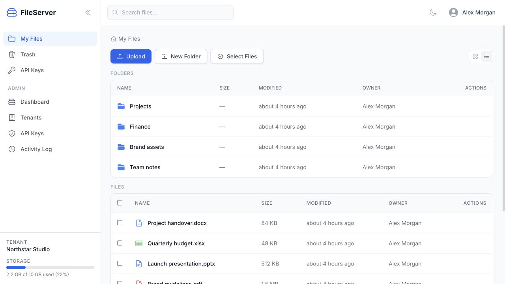
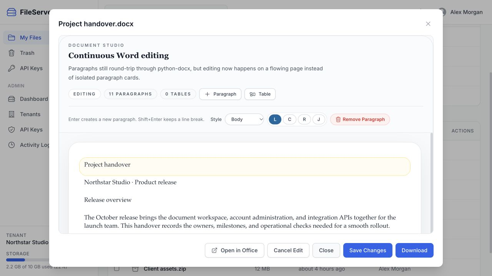
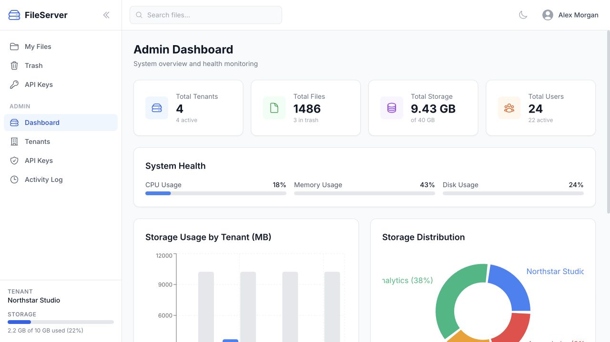
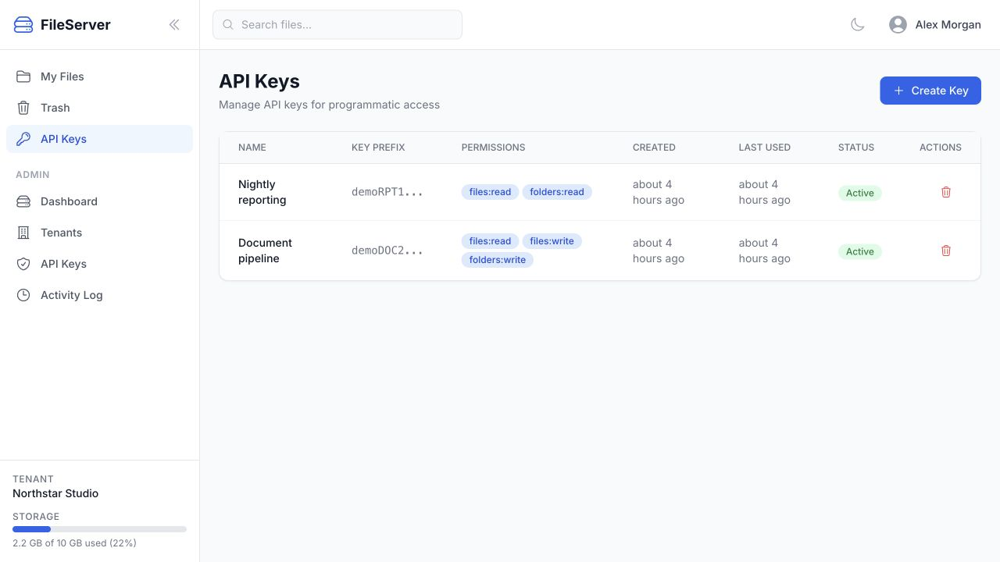
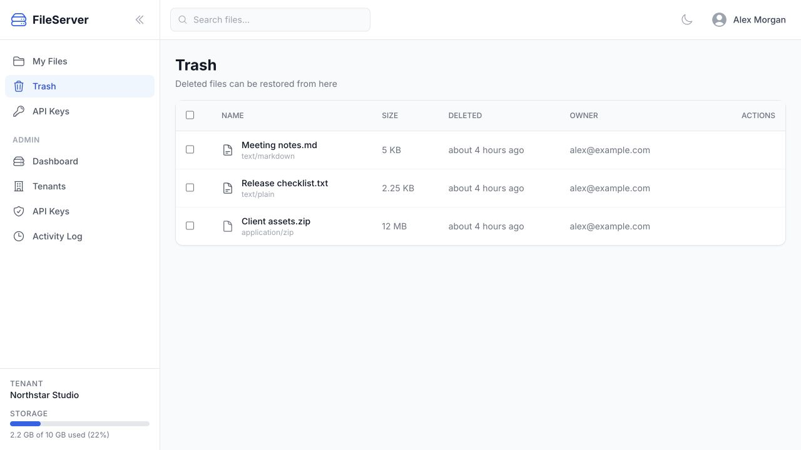

<div align="center">

# FileServer

**Your files. Your workspace. Your infrastructure.**

A self-hosted file workspace with folders, Office document editing, tenant administration, and API access.


[Features](#features) · [Screenshots](#screenshots) · [Quick start](#quick-start) · [Development](#development)



</div>

---

FileServer brings everyday file management and system integrations into one workspace. Browse and organize documents in a familiar web interface, edit supported Office files in place, and give each tenant its own data and storage quota.

## Features

| Feature | What it does |
|---|---|
| **A familiar file workspace** | Upload with drag and drop, organize folders, search, rename, move, copy, and download. Recover deleted files from the trash. |
| **Office files in the browser** | View and edit Word documents, Excel workbooks, and PowerPoint presentations, with tables, formatting, and embedded images. |
| **Tools for larger collections** | Select multiple files for bulk operations, create ZIP archives, and extract archives into folders. |
| **Separate tenant workspaces** | Tenant owners and members work within tenant-scoped data, with per-tenant storage quotas. |
| **Integration access** | Tenant-scoped API keys let scripts and other systems work with files and folders. Keys are shown once when created. |
| **Platform administration** | Manage tenants and their quotas, review storage use, inspect system metrics, and follow file activity. |

## Screenshots

<table align="center" width="100%">
  <tr>
    <td width="50%" align="center" valign="top"><br><sub>View and edit Office documents</sub></td>
    <td width="50%" align="center" valign="top"><br><sub>Review platform storage and quotas</sub></td>
  </tr>
  <tr>
    <td width="50%" align="center" valign="top"><br><sub>Manage integration access</sub></td>
    <td width="50%" align="center" valign="top"><br><sub>Recover deleted files</sub></td>
  </tr>
</table>

Screenshots show the application interface with demo data.

## Quick start

**Requirements:** Python 3.12+, Node.js 18+, and npm. The default local database is SQLite.

### 1. Start the API

```sh
cd backend
python3 -m venv .venv
source .venv/bin/activate
pip install -r requirements.txt
cp .env.example .env
python manage.py migrate
python manage.py seed_accounts
python manage.py runserver
```

On Windows, create the environment with `py -m venv .venv`, activate it with `.venv\Scripts\Activate.ps1`, and copy the environment file with `Copy-Item .env.example .env`.

The API runs at **http://localhost:8000/api/**. `seed_accounts` creates these local development accounts:

| Account | Email | Default password |
|---|---|---|
| Platform super-admin | `admin@fileserver.local` | `FileServer123!` |
| Tenant owner/admin | `tenant-admin@fileserver.local` | `FileServer123!` |
| Tenant member | `user@fileserver.local` | `FileServer123!` |

Set a different seed password with `python manage.py seed_accounts --password "your-password"`. These accounts are for local development.

### 2. Start the web app

In a second terminal:

```sh
cd frontend
npm ci
npm run dev
```

Open **http://localhost:5173** and sign in. Tenant accounts enter the file workspace; the platform admin can manage tenants and storage.

## Configuration

Copy [backend/.env.example](backend/.env.example) before changing backend settings.

| Variable | Purpose |
|---|---|
| `DJANGO_SECRET_KEY`, `DJANGO_DEBUG`, `DJANGO_ALLOWED_HOSTS` | Django secret, development mode, and accepted hosts |
| `CORS_ALLOWED_ORIGINS` | Browser origins allowed to call the API |
| `FILE_UPLOAD_MAX_SIZE` | Upload limit in bytes; defaults to 100 MB |
| `OFFICE_PREVIEW_MAX_FILE_SIZE` | Office parsing limit in bytes; defaults to 20 MB |

The frontend development server proxies `/api/` and `/media/` to the local backend. Review the database and storage implementation before changing deployment targets; environment examples alone do not install a PostgreSQL or S3 storage backend.

## API access

The web client uses JWT bearer tokens. Integrations use `X-API-Key` with a key created by a tenant administrator. Core resources are `/api/files/`, `/api/folders/`, and `/api/apikeys/`; platform administration lives under `/api/admin/`.

See the [API and operations reference](docs/REFERENCE.md) for endpoint tables, example payloads, Office document behavior, and deployment considerations.

## Development

| Area | Commands |
|---|---|
| Frontend | `npm run build`, `npm run lint`, `npm test` from `frontend/` |
| Backend | `python manage.py test` from `backend/` with the environment active |

| Path | Contents |
|---|---|
| `frontend/src/features/` | File workspace, Office editor, authentication, and admin screens |
| `frontend/src/services/` | API clients |
| `backend/apps/` | Accounts, tenants, files, folders, and API keys |
| `docs/` | Screenshots and API reference |

## License

[MIT](LICENSE).
